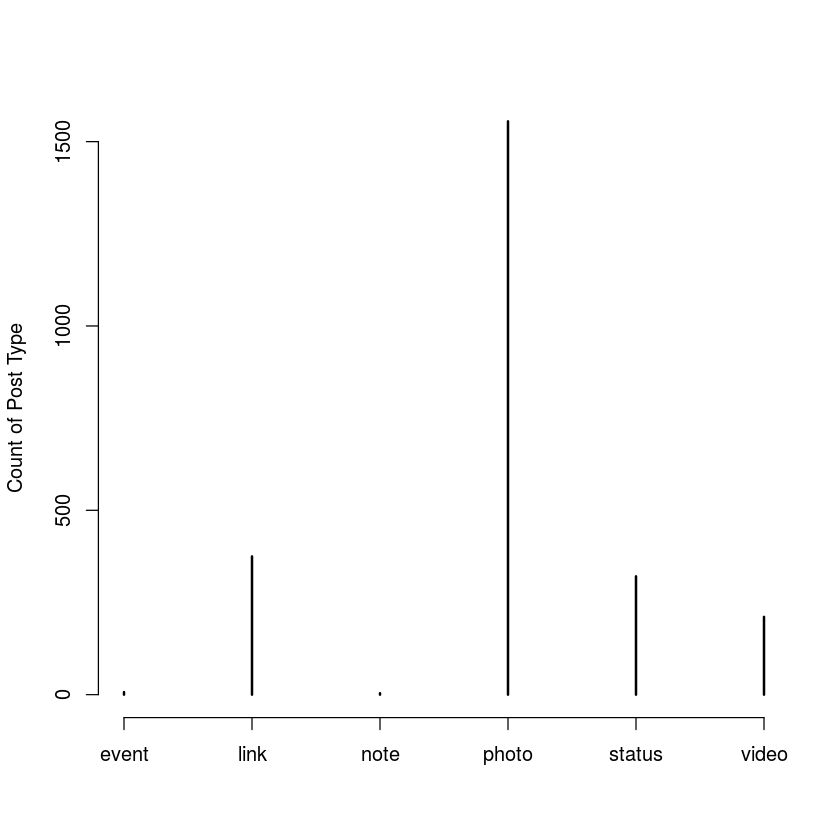
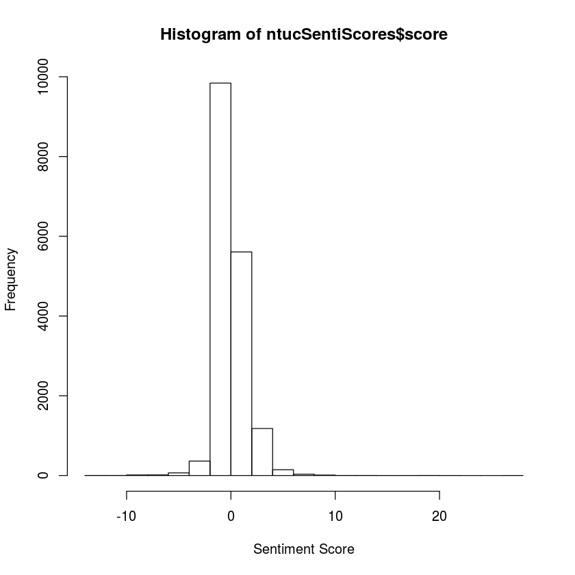
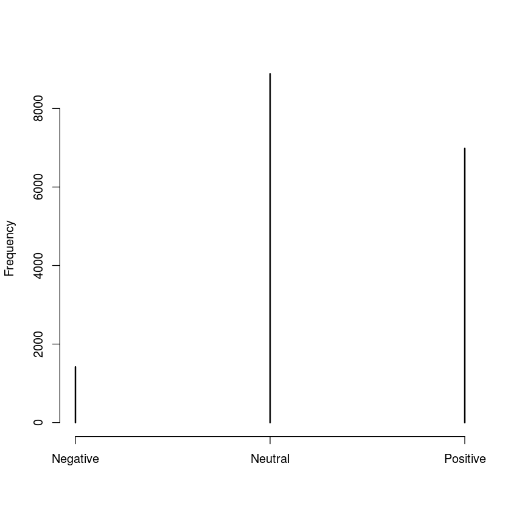
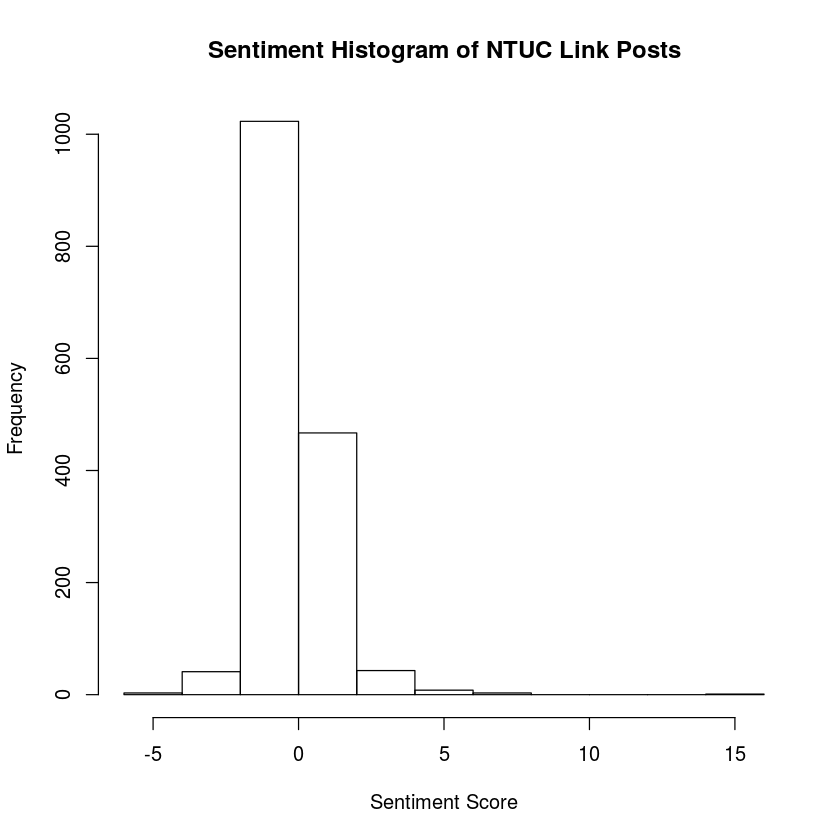
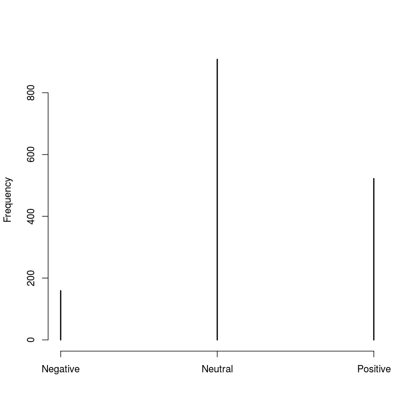
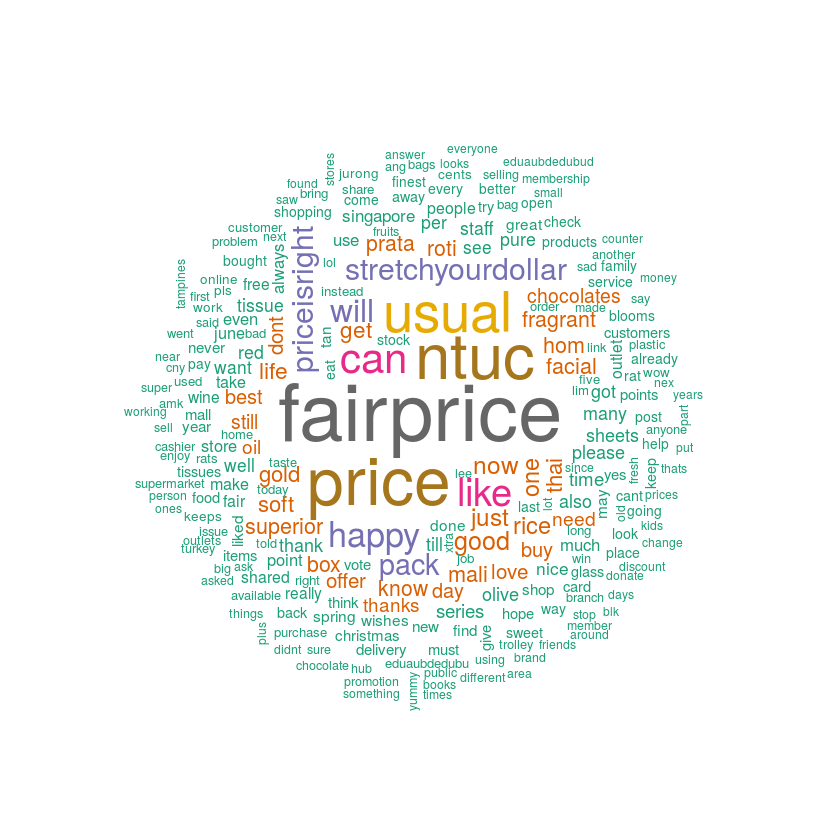
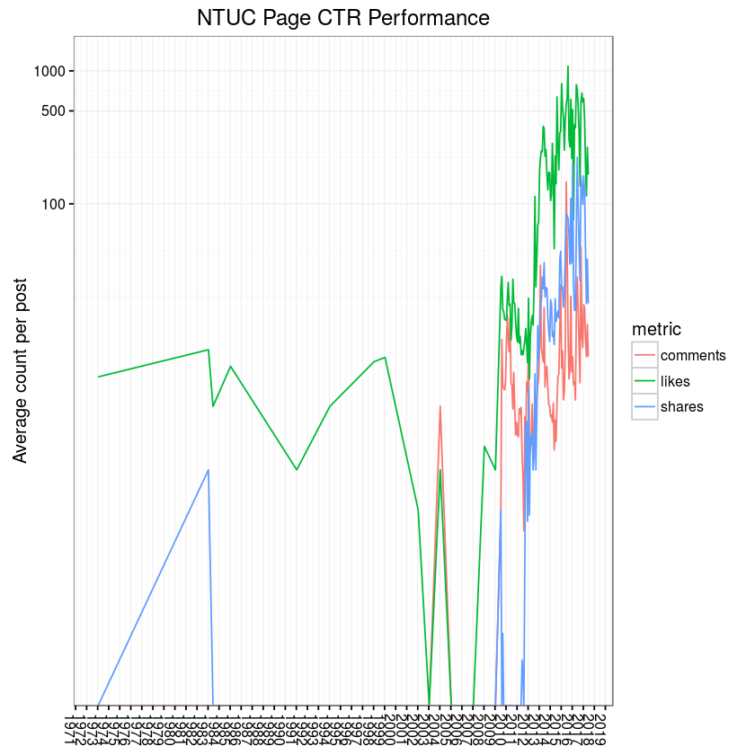
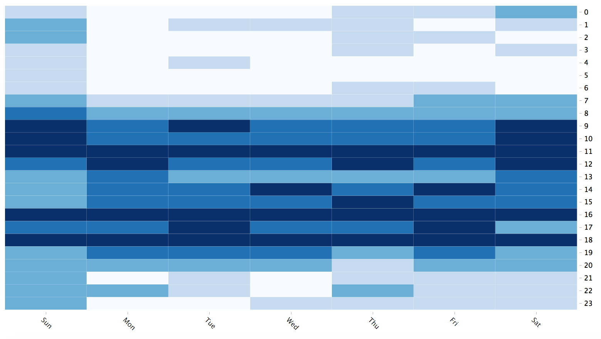

## Facebook Analysis using Rfacebook Package ## 

*The Rfacebook package is authored and maintained by Pablo Barbera and Michael Piccirilli*  

This demo will provide a brief introduction in 
- setting up and using the Rfacebook package to scrape public pages posts and comments. 
- performing a simple lexicon-based sentiment analysis 
- performing text frequency analysis with the use of word cloud will be applied
- plotting a simple trend analysis based on the page's "likes", "shares" and "comments" 
- creating a heatmap of the page posts by day and time 
- and the page's posting frequency. 

## Codes Walkthrough


1) Installing the [__Rfacebook package__](https://cran.r-project.org/web/packages/Rfacebook/Rfacebook.pdf)  


```R
install.packages("Rfacebook")
library(Rfacebook)
```

### Facebook authentication ###


2) Getting Temporary Access Token  
- Get temporary (2hrs) FB access token via: [https://developers.facebook.com/tools/explorer](https://developers.facebook.com/tools/explorer) &gt; click on __Get Token__  
- Replace __token &lt;- ""__ with your token code 
- *You will need Graph API v2.6 and higher to get Reactions (love, haha, wow, sad, angry)* 

3) Creating an App on Facebook Platform
- Create an app via: [https://developers.facebook.com/](https://developers.facebook.com/)  
- Replace __app_id="xxx"__ with your App ID code
- Replace __app_secret="xxx"__ with your App Secret code


```R
token <- "xxxxxxxxxx"
fb_oauth <- fbOAuth(app_id="xxx",app_secret="xxx",extended_permissions = TRUE)

save(fb_oauth, file="fb_oauth")
load("fb_oauth")
```

### Get Posts from Facebook Page ###

4) Get the latest 5000 posts their respective __Reactions__ information from FB Page [__thatsmyfairprice__](https://www.facebook.com/thatsmyfairprice/)


```R
ntucPosts <- getPage("thatsmyfairprice", token, n = 5000, reactions = T)
```


```R
head(ntucPosts)
```


<table>
<thead><tr><th>id</th><th>likes_count</th><th>from_id</th><th>from_name</th><th>message</th><th>created_time</th><th>type</th><th>link</th><th>story</th><th>comments_count</th><th>shares_count</th><th>love_count</th><th>haha_count</th><th>wow_count</th><th>sad_count</th><th>angry_count</th><th>post_datetime</th></tr></thead>
<tbody>
	<tr><td>124299741408_10150633686196409                                                                            </td><td>5                                                                                                         </td><td>124299741408                                                                                              </td><td>NTUC FairPrice                                                                                            </td><td>NA                                                                                                        </td><td>1973-01-01T08:00:00+0000                                                                                  </td><td>link                                                                                                      </td><td>https://www.facebook.com/124299741408/posts/10150633686196409/                                            </td><td>NTUC FairPrice added a life event from 1973: Founded in 1973.                                             </td><td>0                                                                                                         </td><td>0                                                                                                         </td><td>0                                                                                                         </td><td>0                                                                                                         </td><td>0                                                                                                         </td><td>0                                                                                                         </td><td>0                                                                                                         </td><td>1973-01-01 08:00:00                                                                                       </td></tr>
	<tr><td>124299741408_10150856484056409                                                                            </td><td>8                                                                                                         </td><td>124299741408                                                                                              </td><td>NTUC FairPrice                                                                                            </td><td>NA                                                                                                        </td><td>1983-01-01T08:00:00+0000                                                                                  </td><td>photo                                                                                                     </td><td>https://www.facebook.com/thatsmyfairprice/photos/p.10150856484011409/10150856484011409/?type=3            </td><td>NTUC FairPrice added a life event from 1983: NTUC FairPrice Co-operative Ltd Formed.                      </td><td>0                                                                                                         </td><td>1                                                                                                         </td><td>0                                                                                                         </td><td>0                                                                                                         </td><td>0                                                                                                         </td><td>0                                                                                                         </td><td>0                                                                                                         </td><td>1983-01-01 08:00:00                                                                                       </td></tr>
	<tr><td>124299741408_10150856485356409                                                                            </td><td>3                                                                                                         </td><td>124299741408                                                                                              </td><td>NTUC FairPrice                                                                                            </td><td>NA                                                                                                        </td><td>1983-06-01T07:00:00+0000                                                                                  </td><td>link                                                                                                      </td><td>https://www.facebook.com/124299741408/posts/10150856485356409/                                            </td><td>NTUC FairPrice added a life event from June 1983: Used Textbook Project Launched.                         </td><td>0                                                                                                         </td><td>0                                                                                                         </td><td>0                                                                                                         </td><td>0                                                                                                         </td><td>0                                                                                                         </td><td>0                                                                                                         </td><td>0                                                                                                         </td><td>1983-06-01 07:00:00                                                                                       </td></tr>
	<tr><td>124299741408_10150856487136409                                                                            </td><td>6                                                                                                         </td><td>124299741408                                                                                              </td><td>NTUC FairPrice                                                                                            </td><td>NA                                                                                                        </td><td>1985-01-01T08:00:00+0000                                                                                  </td><td>photo                                                                                                     </td><td>https://www.facebook.com/thatsmyfairprice/photos/p.10150856487101409/10150856487101409/?type=3            </td><td>NTUC FairPrice added a life event from 1985: FairPrice Housebrand Products Introduced.                    </td><td>0                                                                                                         </td><td>0                                                                                                         </td><td>0                                                                                                         </td><td>0                                                                                                         </td><td>0                                                                                                         </td><td>0                                                                                                         </td><td>0                                                                                                         </td><td>1985-01-01 08:00:00                                                                                       </td></tr>
	<tr><td>124299741408_10150856489041409                                                                            </td><td>1                                                                                                         </td><td>124299741408                                                                                              </td><td>NTUC FairPrice                                                                                            </td><td>NA                                                                                                        </td><td>1991-01-01T08:00:00+0000                                                                                  </td><td>photo                                                                                                     </td><td>https://www.facebook.com/thatsmyfairprice/photos/p.10150856489011409/10150856489011409/?type=3            </td><td>NTUC FairPrice added a life event from 1991: First Retailer to Implement Bar-Coding at Check-Out Counters.</td><td>0                                                                                                         </td><td>0                                                                                                         </td><td>0                                                                                                         </td><td>0                                                                                                         </td><td>0                                                                                                         </td><td>0                                                                                                         </td><td>0                                                                                                         </td><td>1991-01-01 08:00:00                                                                                       </td></tr>
	<tr><td>124299741408_10150856491601409                                                                            </td><td>3                                                                                                         </td><td>124299741408                                                                                              </td><td>NTUC FairPrice                                                                                            </td><td>NA                                                                                                        </td><td>1994-01-01T08:00:00+0000                                                                                  </td><td>photo                                                                                                     </td><td>https://www.facebook.com/thatsmyfairprice/photos/p.10150856491566409/10150856491566409/?type=3            </td><td>NTUC FairPrice added a life event from 1994: Everyday Low Price (EDLP) Essential Items Introduced.        </td><td>0                                                                                                         </td><td>0                                                                                                         </td><td>0                                                                                                         </td><td>0                                                                                                         </td><td>0                                                                                                         </td><td>0                                                                                                         </td><td>0                                                                                                         </td><td>1994-01-01 08:00:00                                                                                       </td></tr>
</tbody>
</table>


Check how many posts are scraped from the FB page


```R
nrow(ntucPosts)
```


2473


5) Checking the distribution of post type of this FB page


```R
table(ntucPosts$type)
```


    
     event   link   note  photo status  video 
         7    375      4   1555    321    211 


```R
plot(table(ntucPosts$type),ylab="Count of Post Type")
```





6) Let's take a look at the number of __Likes__ &amp; __Reactions__ in each Post Type


```R
install.packages("sqldf")
library(sqldf)
```


```R
postType <- sqldf("select type, count(type) as total_type_count,
                  sum(shares_count) as total_shares,
                  sum(likes_count) as total_likes, 
                  sum(love_count) as total_love,
                  sum(haha_count) as total_haha,
                  sum(wow_count) as total_wow,
                  sum(sad_count) as total_sad,
                  sum(angry_count) as total_angry
                  from ntucPosts group by type")
```


```R
postType
```


<table>
<thead><tr><th>type</th><th>total_type_count</th><th>total_shares</th><th>total_likes</th><th>total_love</th><th>total_haha</th><th>total_wow</th><th>total_sad</th><th>total_angry</th></tr></thead>
<tbody>
	<tr><td>event </td><td>   7  </td><td>    2 </td><td>  2786</td><td>  10  </td><td>  1   </td><td>   0  </td><td>  0   </td><td>  0   </td></tr>
	<tr><td>link  </td><td> 375  </td><td> 9710 </td><td> 83335</td><td> 560  </td><td> 93   </td><td> 484  </td><td> 12   </td><td> 18   </td></tr>
	<tr><td>note  </td><td>   4  </td><td>    4 </td><td>    26</td><td>   0  </td><td>  0   </td><td>   0  </td><td>  0   </td><td>  0   </td></tr>
	<tr><td>photo </td><td>1555  </td><td>34243 </td><td>424959</td><td>3014  </td><td>209   </td><td>1419  </td><td>172   </td><td>138   </td></tr>
	<tr><td>status</td><td> 321  </td><td> 2016 </td><td> 17255</td><td>   6  </td><td> 47   </td><td>  20  </td><td>  8   </td><td>192   </td></tr>
	<tr><td>video </td><td> 211  </td><td>38630 </td><td> 82989</td><td>1593  </td><td>295   </td><td> 392  </td><td> 55   </td><td> 65   </td></tr>
</tbody>
</table>


### Get All Comments from the Scraped Facebook Posts ###

7) Loop through all the posts and get their respective comments


```R
ntucComment <- list()
for (i in 1:length(ntucPosts$id)){
  ntucComment[[i]] <- getPost(ntucPosts$id[i], token, likes=F, comments=T)
  ntucComment[[i]][['reactions']] <- getReactions(post=ntucPosts$id[i], token)
  if (nrow(ntucComment[[i]][["comments"]]) == 0)
    ntucComment[[i]][['comments']][1,] <- c(NA,NA,NA,NA,NA,NA,NA)
}
ntucComments <- do.call(rbind, lapply(ntucComment, data.frame, stringsAsFactors=FALSE))
```


```R
head(ntucComments)
```


<table>
<thead><tr><th>post.from_id</th><th>post.from_name</th><th>post.message</th><th>post.created_time</th><th>post.type</th><th>post.link</th><th>post.id</th><th>post.likes_count</th><th>post.comments_count</th><th>post.shares_count</th><th>...</th><th>comments.likes_count</th><th>comments.comments_count</th><th>comments.id</th><th>reactions.id</th><th>reactions.likes_count</th><th>reactions.love_count</th><th>reactions.haha_count</th><th>reactions.wow_count</th><th>reactions.sad_count</th><th>reactions.angry_count</th></tr></thead>
<tbody>
	<tr><td>124299741408                                                                                  </td><td>NTUC FairPrice                                                                                </td><td>NA                                                                                            </td><td>1973-01-01T08:00:00+0000                                                                      </td><td>link                                                                                          </td><td>https://www.facebook.com/124299741408/posts/10150633686196409/                                </td><td>124299741408_10150633686196409                                                                </td><td>5                                                                                             </td><td>0                                                                                             </td><td>0                                                                                             </td><td>...                                                                                           </td><td>NA                                                                                            </td><td>NA                                                                                            </td><td>NA                                                                                            </td><td>124299741408_10150633686196409                                                                </td><td>5                                                                                             </td><td>0                                                                                             </td><td>0                                                                                             </td><td>0                                                                                             </td><td>0                                                                                             </td><td>0                                                                                             </td></tr>
	<tr><td>124299741408                                                                                  </td><td>NTUC FairPrice                                                                                </td><td>NA                                                                                            </td><td>1983-01-01T08:00:00+0000                                                                      </td><td>photo                                                                                         </td><td>https://www.facebook.com/thatsmyfairprice/photos/p.10150856484011409/10150856484011409/?type=3</td><td>124299741408_10150856484056409                                                                </td><td>8                                                                                             </td><td>0                                                                                             </td><td>1                                                                                             </td><td>...                                                                                           </td><td>NA                                                                                            </td><td>NA                                                                                            </td><td>NA                                                                                            </td><td>124299741408_10150856484056409                                                                </td><td>8                                                                                             </td><td>0                                                                                             </td><td>0                                                                                             </td><td>0                                                                                             </td><td>0                                                                                             </td><td>0                                                                                             </td></tr>
	<tr><td>124299741408                                                                                  </td><td>NTUC FairPrice                                                                                </td><td>NA                                                                                            </td><td>1983-06-01T07:00:00+0000                                                                      </td><td>link                                                                                          </td><td>https://www.facebook.com/124299741408/posts/10150856485356409/                                </td><td>124299741408_10150856485356409                                                                </td><td>3                                                                                             </td><td>0                                                                                             </td><td>0                                                                                             </td><td>...                                                                                           </td><td>NA                                                                                            </td><td>NA                                                                                            </td><td>NA                                                                                            </td><td>124299741408_10150856485356409                                                                </td><td>3                                                                                             </td><td>0                                                                                             </td><td>0                                                                                             </td><td>0                                                                                             </td><td>0                                                                                             </td><td>0                                                                                             </td></tr>
	<tr><td>124299741408                                                                                  </td><td>NTUC FairPrice                                                                                </td><td>NA                                                                                            </td><td>1985-01-01T08:00:00+0000                                                                      </td><td>photo                                                                                         </td><td>https://www.facebook.com/thatsmyfairprice/photos/p.10150856487101409/10150856487101409/?type=3</td><td>124299741408_10150856487136409                                                                </td><td>6                                                                                             </td><td>0                                                                                             </td><td>0                                                                                             </td><td>...                                                                                           </td><td>NA                                                                                            </td><td>NA                                                                                            </td><td>NA                                                                                            </td><td>124299741408_10150856487136409                                                                </td><td>6                                                                                             </td><td>0                                                                                             </td><td>0                                                                                             </td><td>0                                                                                             </td><td>0                                                                                             </td><td>0                                                                                             </td></tr>
	<tr><td>124299741408                                                                                  </td><td>NTUC FairPrice                                                                                </td><td>NA                                                                                            </td><td>1991-01-01T08:00:00+0000                                                                      </td><td>photo                                                                                         </td><td>https://www.facebook.com/thatsmyfairprice/photos/p.10150856489011409/10150856489011409/?type=3</td><td>124299741408_10150856489041409                                                                </td><td>1                                                                                             </td><td>0                                                                                             </td><td>0                                                                                             </td><td>...                                                                                           </td><td>NA                                                                                            </td><td>NA                                                                                            </td><td>NA                                                                                            </td><td>124299741408_10150856489041409                                                                </td><td>1                                                                                             </td><td>0                                                                                             </td><td>0                                                                                             </td><td>0                                                                                             </td><td>0                                                                                             </td><td>0                                                                                             </td></tr>
	<tr><td>124299741408                                                                                  </td><td>NTUC FairPrice                                                                                </td><td>NA                                                                                            </td><td>1994-01-01T08:00:00+0000                                                                      </td><td>photo                                                                                         </td><td>https://www.facebook.com/thatsmyfairprice/photos/p.10150856491566409/10150856491566409/?type=3</td><td>124299741408_10150856491601409                                                                </td><td>3                                                                                             </td><td>0                                                                                             </td><td>0                                                                                             </td><td>...                                                                                           </td><td>NA                                                                                            </td><td>NA                                                                                            </td><td>NA                                                                                            </td><td>124299741408_10150856491601409                                                                </td><td>3                                                                                             </td><td>0                                                                                             </td><td>0                                                                                             </td><td>0                                                                                             </td><td>0                                                                                             </td><td>0                                                                                             </td></tr>
</tbody>
</table>


```R
nrow(ntucComments)
```


19518


There are __19518__ rows of comments scraped but there are not actually __19518__ comments being made. This is because some of the posts do not have any comments made and their respective comments columns will show *NA*.

### Dataframe Variable Names Standardization ###

First, let's proceed to standardize the dataframe variable names


```R
names(ntucComments)
```


<ol class="list-inline">
	<li>'post.from_id'</li>
	<li>'post.from_name'</li>
	<li>'post.message'</li>
	<li>'post.created_time'</li>
	<li>'post.type'</li>
	<li>'post.link'</li>
	<li>'post.id'</li>
	<li>'post.likes_count'</li>
	<li>'post.comments_count'</li>
	<li>'post.shares_count'</li>
	<li>'comments.from_id'</li>
	<li>'comments.from_name'</li>
	<li>'comments.message'</li>
	<li>'comments.created_time'</li>
	<li>'comments.likes_count'</li>
	<li>'comments.comments_count'</li>
	<li>'comments.id'</li>
	<li>'reactions.id'</li>
	<li>'reactions.likes_count'</li>
	<li>'reactions.love_count'</li>
	<li>'reactions.haha_count'</li>
	<li>'reactions.wow_count'</li>
	<li>'reactions.sad_count'</li>
	<li>'reactions.angry_count'</li>
</ol>


8) We will replace all __.__ with _ instead


```R
names(ntucComments) <- gsub("\\.", "_", names(ntucComments))
names(ntucComments)
```


<ol class="list-inline">
	<li>'post_from_id'</li>
	<li>'post_from_name'</li>
	<li>'post_message'</li>
	<li>'post_created_time'</li>
	<li>'post_type'</li>
	<li>'post_link'</li>
	<li>'post_id'</li>
	<li>'post_likes_count'</li>
	<li>'post_comments_count'</li>
	<li>'post_shares_count'</li>
	<li>'comments_from_id'</li>
	<li>'comments_from_name'</li>
	<li>'comments_message'</li>
	<li>'comments_created_time'</li>
	<li>'comments_likes_count'</li>
	<li>'comments_comments_count'</li>
	<li>'comments_id'</li>
	<li>'reactions_id'</li>
	<li>'reactions_likes_count'</li>
	<li>'reactions_love_count'</li>
	<li>'reactions_haha_count'</li>
	<li>'reactions_wow_count'</li>
	<li>'reactions_sad_count'</li>
	<li>'reactions_angry_count'</li>
</ol>


9) Create a function that coverts FB date format to GMT


```R
format.facebook.date <- function(datestring) {
  date <- as.POSIXct(datestring, format = "%Y-%m-%dT%H:%M:%S+0000", tz="GMT")
}
```

10) Adding two new variable __post_datetime__ &amp; __comments_datetime__ to __ntucComments__ dataframe

This two variable will use the __format.facebook.date__ function to convert the original FB date format to GMT format


```R
ntucComments$comments_datetime <- format.facebook.date(ntucComments$comments_created_time)
ntucComments$post_datetime <- format.facebook.date(ntucComments$post_created_time)
```

### Comments Variable Cleaning ###

11) Convert the comments variable column to ASCII


```R
ntucComments$comments_message <- iconv(ntucComments$comments_message, "ASCII", "UTF-8", sub="")
```

12) Remove comments made by the organisation itself


```R
ntucCommentsClean <- subset(ntucComments, comments_from_name != "NTUC FairPrice")
```

13) Substituting emoticons with text/descriptions


```R
ntucCommentsClean$comments_message <- gsub(":-)", " happy ", ntucCommentsClean$comments_message)
ntucCommentsClean$comments_message <- gsub(";-)", " happy ", ntucCommentsClean$comments_message)
ntucCommentsClean$comments_message <- gsub(":)", " happy ", ntucCommentsClean$comments_message)
ntucCommentsClean$comments_message <- gsub(";)", " happy ", ntucCommentsClean$comments_message)
ntucCommentsClean$comments_message <- gsub("=p", " happy ", ntucCommentsClean$comments_message)
ntucCommentsClean$comments_message <- gsub(":p", " happy ", ntucCommentsClean$comments_message)
ntucCommentsClean$comments_message <- gsub(":P", " happy ", ntucCommentsClean$comments_message)
ntucCommentsClean$comments_message <- gsub("=P", " happy ", ntucCommentsClean$comments_message)
ntucCommentsClean$comments_message <- gsub("=)", " happy ", ntucCommentsClean$comments_message)
ntucCommentsClean$comments_message <- gsub(":-)", " happy ", ntucCommentsClean$comments_message)
ntucCommentsClean$comments_message <- gsub("<3", " love ", ntucCommentsClean$comments_message)
ntucCommentsClean$comments_message <- gsub(":\\(", " sad ", ntucCommentsClean$comments_message)
ntucCommentsClean$comments_message <- gsub(":-\\(", " sad ", ntucCommentsClean$comments_message)
ntucCommentsClean$comments_message <- gsub(":x", " oops ", ntucCommentsClean$comments_message)
ntucCommentsClean$comments_message <- gsub(":X", " oops ", ntucCommentsClean$comments_message)
```

14) Substituting line breaks, tabs, digits, url and punctuations with empty space


```R
ntucCommentsClean$comments_message <- gsub("\n", " ", ntucCommentsClean$comments_message) 
ntucCommentsClean$comments_message <- gsub("\t", " ", ntucCommentsClean$comments_message) 
ntucCommentsClean$comments_message <- gsub("\\d", "", ntucCommentsClean$comments_message) 
ntucCommentsClean$comments_message <- gsub("http[^[:blank:]]+", "", ntucCommentsClean$comments_message)
ntucCommentsClean$comments_message <- gsub("[[:punct:]]", "", ntucCommentsClean$comments_message)
```

15) Removing rows with less than 3 characters (I deemed to be not useful at all for text analysis)


```R
ntucCommentsClean <- subset(ntucCommentsClean, nchar(comments_message) > 2)
```

### Lexicon-based Sentiment Analysis ###

16) load positive and negative lexicons


```R
positives = readLines("positive-words.txt")
negatives = readLines("negative-words.txt")
```

17) Adding custom abbreviation / internet slangs to lexicon


```R
positives = c(positives, 'thx', 'congrats', 'luv')
negatives = c(negatives, 'wtf', 'cancellation')
```

18) Installing required packages


```R
install.packages("stringr")
install.packages("dplyr")
install.packages("plyr")
library(stringr)
library(dplyr)
library(plyr)
```

    Installing package into '/home/nbcommon/R'
    (as 'lib' is unspecified)
    Installing package into '/home/nbcommon/R'
    (as 'lib' is unspecified)
    Installing package into '/home/nbcommon/R'
    (as 'lib' is unspecified)
    
    Attaching package: 'dplyr'
    
    The following objects are masked from 'package:stats':
    
        filter, lag
    
    The following objects are masked from 'package:base':
    
        intersect, setdiff, setequal, union
    
    ------------------------------------------------------------------------------
    You have loaded plyr after dplyr - this is likely to cause problems.
    If you need functions from both plyr and dplyr, please load plyr first, then dplyr:
    library(plyr); library(dplyr)
    ------------------------------------------------------------------------------
    
    Attaching package: 'plyr'
    
    The following objects are masked from 'package:dplyr':
    
        arrange, count, desc, failwith, id, mutate, rename, summarise,
        summarize
    


19) Creating a simple scoring sentiment analysis function


```R
score.sentiment = function(sentences, pos.words, neg.words, .progress='none')
{
  require(plyr)
  require(stringr)
  
  scores = laply(sentences, function(sentence, pos.words, neg.words) {
    
    sentence = gsub('[[:punct:]]', '', sentence)
    sentence = gsub('[[:cntrl:]]', '', sentence)
    sentence = gsub('\\d+', '', sentence)
    sentence = tolower(sentence)
    
    word.list = str_split(sentence, '\\s+')
    words = unlist(word.list)
    
    pos.matches = match(words, pos.words)
    neg.matches = match(words, neg.words)

    pos.matches = !is.na(pos.matches)
    neg.matches = !is.na(neg.matches)
    
    score = sum(pos.matches) - sum(neg.matches)
    
    return(score)
  }, pos.words, neg.words, .progress=.progress )
  
  scores.df = data.frame(score=scores, text=sentences)
  return(scores.df)
}
```


```R
ntucSentiScores <- score.sentiment(ntucCommentsClean$comments_message,positives,negatives,.progress = "text")
```

      |======================================================================| 100%


```R
hist(ntucSentiScores$score,xlab="Sentiment Score")
```





he histogram shows that most of the comments have a score hovering around the 0 score mark. The histogram depicts a normal distribution indicating that most of the comments are neutral with some positive and negative comments

20) Now, let's add a new variable __sentiment_polar__ to determine the sentiment of the comment


```R
ntucCommentsClean$sentiment <- ntucSentiScores$score
ntucCommentsClean$sentiment_polar <- ifelse(ntucCommentsClean$sentiment == 0, "Neutral", ifelse(ntucCommentsClean$sentiment > 0, "Positive", "Negative"))
```


```R
head(ntucCommentsClean, n=2)
```


<table>
<thead><tr><th></th><th>post_from_id</th><th>post_from_name</th><th>post_message</th><th>post_created_time</th><th>post_type</th><th>post_link</th><th>post_id</th><th>post_likes_count</th><th>post_comments_count</th><th>post_shares_count</th><th>...</th><th>reactions_likes_count</th><th>reactions_love_count</th><th>reactions_haha_count</th><th>reactions_wow_count</th><th>reactions_sad_count</th><th>reactions_angry_count</th><th>comments_datetime</th><th>post_datetime</th><th>sentiment</th><th>sentiment_polar</th></tr></thead>
<tbody>
	<tr><th>13</th><td>124299741408                                                                                  </td><td>NTUC FairPrice                                                                                </td><td>NA                                                                                            </td><td>2004-01-01T08:00:00+0000                                                                      </td><td>photo                                                                                         </td><td>https://www.facebook.com/thatsmyfairprice/photos/p.10150858221106409/10150858221106409/?type=3</td><td>124299741408_10150858221126409                                                                </td><td>1                                                                                             </td><td>3                                                                                             </td><td>0                                                                                             </td><td>...                                                                                           </td><td>1                                                                                             </td><td>0                                                                                             </td><td>0                                                                                             </td><td>0                                                                                             </td><td>0                                                                                             </td><td>0                                                                                             </td><td>2012-06-08 09:23:48                                                                           </td><td>2004-01-01 08:00:00                                                                           </td><td> 0                                                                                            </td><td>Neutral                                                                                       </td></tr>
	<tr><th>15</th><td>124299741408                                                                                  </td><td>NTUC FairPrice                                                                                </td><td>NA                                                                                            </td><td>2004-01-01T08:00:00+0000                                                                      </td><td>photo                                                                                         </td><td>https://www.facebook.com/thatsmyfairprice/photos/p.10150858221106409/10150858221106409/?type=3</td><td>124299741408_10150858221126409                                                                </td><td>1                                                                                             </td><td>3                                                                                             </td><td>0                                                                                             </td><td>...                                                                                           </td><td>1                                                                                             </td><td>0                                                                                             </td><td>0                                                                                             </td><td>0                                                                                             </td><td>0                                                                                             </td><td>0                                                                                             </td><td>2015-03-04 19:44:11                                                                           </td><td>2004-01-01 08:00:00                                                                           </td><td>-1                                                                                            </td><td>Negative                                                                                      </td></tr>
</tbody>
</table>


```R
table(ntucCommentsClean$sentiment_polar) 
```


    
    Negative  Neutral Positive 
        1418     8884     6986 


```R
plot(table(ntucCommentsClean$sentiment_polar),ylab="Frequency")
```





```R
mean(ntucCommentsClean$sentiment)
```


0.56461129106895


mean sentiment score of 0.56 indicates a mostly neutral and positive comments

*You can continue to check the comments sentiments based on the post type as well*  
*For e.g. sentiment for __post_type = "link"__*


```R
ntucLink <- subset(ntucCommentsClean, post_type == "link") 
hist(ntucLink$sentiment, xlab = "Sentiment Score", main = "Sentiment Histogram of NTUC Link Posts")
table(ntucLink$sentiment_polar)
mean(ntucLink$sentiment)
plot(table(ntucLink$sentiment_polar),ylab="Frequency")
```


    
    Negative  Neutral Positive 
         159      908      522 


0.351793580868471








### Text Frequency Analysis ###

21) Installing required packages for Text Analysis


```R
Needed = c("tm", "SnowballC", "RColorBrewer", "wordcloud")  
install.packages(Needed, dependencies=TRUE)
```

    Installing packages into '/home/nbcommon/R'
    (as 'lib' is unspecified)
    Warning message:
    "dependencies 'Rcampdf', 'Rgraphviz', 'tm.lexicon.GeneralInquirer' are not available"also installing the dependency 'Rpoppler'
    
    Warning message in install.packages(Needed, dependencies = TRUE):
    "installation of package 'Rpoppler' had non-zero exit status"

22) Creating corpus, lower case transformation, removing of punctuation / numbers and stopwords


```R
library(tm)
# create corpus
corpus = Corpus(VectorSource(ntucCommentsClean$comments_message))
# Conversion to lower case
corpus = tm_map(corpus, content_transformer(tolower)) 
# Removal of punctuation
corpus = tm_map(corpus, removePunctuation)
# Removal of numbers
corpus = tm_map(corpus, removeNumbers)
# Removal of stopwords
corpus = tm_map(corpus, removeWords, stopwords("english"))
```

    Loading required package: NLP


23) Generating wordcloud


```R
library(wordcloud)
wordcloud(corpus, random.order = F, min.freq=2, max.words=250,
          colors = brewer.pal(8, "Dark2"))
```





### Page Trend Analysis ###

24) Creating function for aggregation matric


```R
aggregate.matric <- function(metric){
  m <- aggregate(ntucPosts[[paste0(metric, "_count")]],
                 list(month = ntucPosts$month), 
                 mean)
  m$month <- as.Date(paste0(m$month, "-15"))
  m$metric <- metric
  return(m)
}
```


```R
ntucPosts$timestamp <- format.facebook.date(ntucPosts$created_time)
ntucPosts$month <- format(ntucPosts$timestamp, "%Y-%m")
```


```R
df.list <- lapply(c("likes", "comments", "shares"), aggregate.matric)
df <- do.call(rbind, df.list)
```

25) Installing ggplot2 package


```R
install.packages("ggplot2")
install.packages("scales")
library(ggplot2)
library(scales)
```

    Installing package into '/home/nbcommon/R'
    (as 'lib' is unspecified)
    Installing package into '/home/nbcommon/R'
    (as 'lib' is unspecified)
    
    Attaching package: 'ggplot2'
    
    The following object is masked from 'package:NLP':
    
        annotate
    


26) Creating the trend plot


```R
ggplot(df, aes(x = month, y = x, group = metric)) +
  geom_line(aes(color = metric)) +
  scale_x_date(date_breaks = "years", labels = date_format("%Y")) +
  scale_y_log10("Average count per post", breaks = c(100, 500, 1000)) +
  theme_bw() +
  theme(axis.title.x = element_blank(), axis.text.x=element_text(angle = -90, hjust = 0)) +
  ggtitle("NTUC Page CTR Performance") 
```





### Organisation FB Post Day/Time Heatmap ###

27) Installing lubridate package to work with Date and Time


```R
install.packages("lubridate")
library(lubridate)
```

    Installing package into '/home/nbcommon/R'
    (as 'lib' is unspecified)
    
    Attaching package: 'lubridate'
    
    The following object is masked from 'package:base':
    
        date
    


28) Creating the relevant date and time variables


```R
ntucPosts$datetime <- format.facebook.date(ntucPosts$created_time)
ntucPosts$dayweek <- wday(ntucPosts$datetime, label=T)
ntucPosts$dayint <- wday(ntucPosts$datetime)
ntucPosts$sghour <- with_tz(ntucPosts$datetime, "Asia/Singapore")
ntucPosts$hour <- hour(ntucPosts$sghour)
```

29) Installing heatmap package


```R
install.packages("d3heatmap")
library(d3heatmap)
```

    Installing package into '/home/nbcommon/R'
    (as 'lib' is unspecified)
    also installing the dependency 'htmlwidgets'
    


30) Creating heatmap of posts by day and time


```R
heatmapFrame <- matrix(0,nrow=24,ncol=7);
rownames(heatmapFrame) <- 0:23
colnames(heatmapFrame) <- c("Sun", "Mon", "Tue", "Wed", "Thu", "Fri", "Sat")

for (i in 1:24) {
  for (j in 1:7) {
    heatmapFrame[i,j] <- nrow(subset(ntucPosts,dayint==j & hour==i-1))
  }
}
d3heatmap(heatmapFrame, scale = "column",dendrogram = "none", color = scales::col_quantile("Blues", NULL, 5))
```



You can amend the codes to create and show the day and time heatmap for customers' comments using the above provided code 

### Organisation Posts Frequency ###

31) Finally, let's look at the posts frequency by the organisation


```R
time.interval <- min(ntucPosts$datetime) %--% max(ntucPosts$datetime)
sampledays <- round(time.interval / ddays(1))

ntucPostFreq <- sampledays / nrow(ntucPosts)
```


```R
ntucPostFreq
```


6.57096643752527


It seems that the organisation would create a new post every __6.5__ days


### Future Improvements ###

Further analysis such as:
- comparision of organisation's post timing and customers' active timing can be performed to determine if the organisation is posting contents at the right time
- topic analysis (via the use of LDAvis) on customers' contents can be perform to determine what topics/subjects customers are talking about or are interested in
